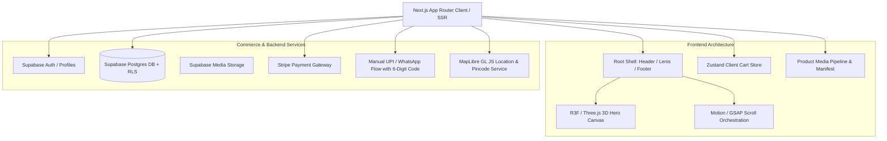

# ARCHITECTURE.md — Cozy_Crochets ("The Living Yarn Store")

## 1. System Overview

Cozy_Crochets is a premium, accessible e-commerce storefront for handmade artisan crochet products (Bags, Bouquets, Headbands, Key rings, Kid shoes, Roses, Sunflowers). The system delivers a tactile, editorial visual experience with cinematic motion, an optimized 3D WebGL hero scene, and a reliable commerce layer designed for Netlify deployment and Supabase backend services.



---

## 2. Core Technology Stack

- **Framework**: Next.js 15+ (App Router, Server Components, Route Handlers, Server Actions).
- **Runtime & Language**: Node.js v20+, TypeScript (Strict Mode).
- **Styling**: Tailwind CSS v3.4+, PostCSS, `tailwindcss-animate`, CSS Custom Properties for design tokens.
- **Component Primitives**: shadcn/ui pattern architecture (Radix UI primitives), Lucide React icons.
- **3D & WebGL**: Three.js, `@react-three/fiber`, `@react-three/drei`.
- **Motion & Scrolling**:
  - `motion` (`motion/react` — strict avoidance of `framer-motion` imports).
  - `gsap` + `ScrollTrigger` for cinematic scroll timelines and pins.
  - `lenis` for smooth inertial scrolling and normalized scroll velocity.
- **State Management**:
  - Server state via Next.js Server Components and Server Actions.
  - Client state via Zustand (`cart-store.ts`, UI state).
- **Form Handling & Validation**: React Hook Form, Zod schema validation.
- **Mapping & Geolocation**: MapLibre GL JS (open-source vector/raster map rendering).
- **Payment Abstraction**:
  - Primary gateway: Stripe (PaymentIntents, Webhook validation).
  - Local / Direct gateway: Manual UPI QR & WhatsApp direct order routing with 6-digit administrative verification code.
- **Backend & Database**: Supabase (PostgreSQL with Row Level Security, Supabase Auth, Storage).
- **Deployment Target**: Netlify with GitHub CI/CD integration.

---

## 3. Directory Layout & Module Structure

```
Cozy_Crochet_AGY/
├── .agents/                    # Agent instructions, skills, and MCP configurations
├── docs/                       # Architectural and technical documentation
│   ├── ARCHITECTURE.md
│   ├── DESIGN_SYSTEM.md
│   ├── DATA_MODEL.md
│   ├── MOTION_SYSTEM.md
│   ├── SECURITY.md
│   └── IMPLEMENTATION_PLAN.md
├── scripts/
│   └── generate-product-manifest.ts  # Typed product media indexing engine
├── supabase/
│   ├── migrations/             # Timestamped SQL migrations with RLS
│   └── seed.sql                # Initial 7 product catalog and settings seed
├── public/
│   └── products/               # Symlinked/served product folder media
├── src/
│   ├── app/                    # Next.js App Router (pages, layouts, routes)
│   │   ├── (store)/            # Customer-facing storefront routes
│   │   │   ├── page.tsx        # Homepage (3D hero, craft story, showcase)
│   │   │   ├── shop/           # Product catalog
│   │   │   ├── product/[slug]/ # Product detail & swipeable gallery
│   │   │   ├── search/         # Instant search & filter
│   │   │   ├── customize/      # Custom crochet bespoke order form
│   │   │   ├── cart/           # Cart page
│   │   │   ├── checkout/       # Multi-provider checkout
│   │   │   ├── orders/         # Customer order tracking
│   │   │   ├── account/        # User profile & address book
│   │   │   ├── login/          # Auth entrypoint
│   │   │   └── (info)/         # about, contact, privacy, shipping, returns
│   │   ├── admin/              # Administrative control center
│   │   │   ├── dashboard/
│   │   │   ├── products/
│   │   │   ├── orders/
│   │   │   ├── reviews/
│   │   │   ├── custom-requests/
│   │   │   ├── banners/
│   │   │   └── settings/
│   │   ├── layout.tsx          # Root shell layout with fonts and Lenis
│   │   └── globals.css         # Token definitions and baseline CSS
│   ├── components/
│   │   ├── hero/               # 3D R3F hero scene and fallback
│   │   ├── layout/             # Header, Navigation, Footer, LocationDrawer
│   │   ├── product/            # ProductCard, Gallery, Lightbox, PriceTag
│   │   ├── commerce/           # AddToCart, CartDrawer, CheckoutForm
│   │   ├── ui/                 # shadcn/ui accessible primitives
│   │   └── motion/             # Reveal, MagneticButton, ParallaxContainer
│   ├── data/                   # Generated media manifest and static catalog
│   ├── lib/
│   │   ├── supabase/           # SSR and client Supabase factories
│   │   ├── payments/           # Stripe and UPI/WhatsApp abstractions
│   │   ├── map/                # MapLibre setup and geocoding utilities
│   │   └── utils.ts            # Class merging and formatting helpers
│   ├── store/                  # Zustand client stores
│   └── types/                  # Shared TypeScript interfaces and DB types
└── package.json
```

---

## 4. Product Media Indexing Strategy

Product media resides in root folders (`Bag/`, `Boque/`, `HeadBands/`, `Key_Ring/`, `Kid_Shoe/`, `Rose/`, `Sunflower/`). The automated indexing script enforces a deterministic 5-slot priority:

1. **Slot 1 (Main)**: Exact `main.{png,jpg,jpeg,webp}` (Primary hero image for card and gallery).
2. **Slot 2 (Video)**: Exact `Video.mp4` (Autoplaying, muted, looped portrait video showcase).
3. **Slot 3 (Single)**: Exact `Single.{png,jpg,jpeg,webp}` (Individual product focus photo).
4. **Slot 4 (Bundle)**: Exact `Bundle.{png,jpg,jpeg,webp}` (Packaged or grouped display photo).
5. **Slot 5+ (Variants / Extras)**: Remaining files sorted with natural alphanumeric ordering (`localeCompare(..., { numeric: true })`), cleanly supporting spaces and parentheses (e.g. `key (4).jpeg`).

---

## 5. 3D & WebGL Subsystem

The storefront adheres to the principle: **One heroic WebGL canvas, never a full WebGL site.**

- **Scene Content**: "The Living Yarn Store" hero environment featuring a procedural yarn ball with fiber bump textures, organic crochet petal formations, and looping thread paths.
- **Device Capping**: DPR capped at `[1, 1.75]` on desktop and `[1, 1.25]` on mobile.
- **Resource Management**:
  - Canvas visibility tracked via `IntersectionObserver`. When off-screen, rendering frames are suspended.
  - When `document.hidden` is active (background tab), animation loops pause immediately.
  - Detects `prefers-reduced-motion` and renders a clean, high-resolution static photographic composition without WebGL execution.
- **GPU Budget**: Draw calls limited to `< 150` on desktop and `< 50` on mobile hardware.

---

## 6. Payment Architecture

Payment processing supports dual rails through a unified payment provider interface:

```typescript
export interface PaymentProvider {
  createPayment(order: OrderPayload): Promise<PaymentInitiationResult>;
  verifyPayment(verificationPayload: PaymentVerificationPayload): Promise<PaymentVerificationResult>;
}
```

1. **Stripe Rail**: PCI-compliant credit/debit card, Apple Pay, and Google Pay processing with asynchronous webhook confirmation.
2. **Manual UPI & WhatsApp Rail**:
   - Generates dynamic UPI intent deep-links and standard UPI QR codes with order reference and exact amount in paise.
   - Generates pre-formatted WhatsApp order confirmation message with line items and customer details.
   - Admin panel provides a 6-digit verification code check where store operators confirm receipt of UPI funds before flipping order status to `confirmed`.

---

## 7. Deployment & Netlify Strategy

- **Static Generation with Incremental Hydration**: Marketing pages (`/about`, `/contact`, `/shipping`, `/returns`) and base product pages are statically generated with ISR.
- **SSR & Middleware**: Dynamic routes (`/account`, `/checkout`, `/admin/*`) run via Netlify Next.js Runtime Functions.
- **Zero Secrets in Repository**: All environment variables adhere to `.env.example` templates and are injected through Netlify environment management.
