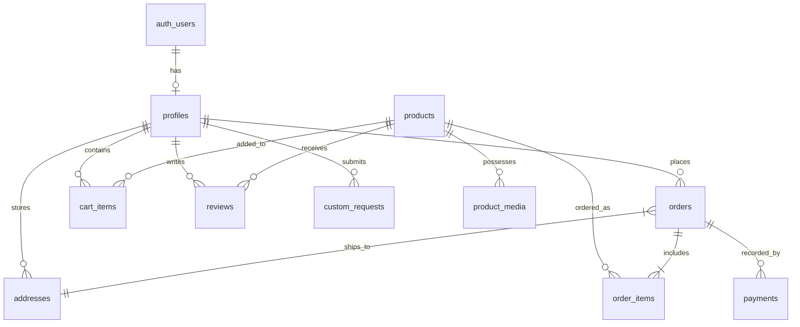

# DATA_MODEL.md — Cozy_Crochets Supabase Architecture

## 1. Overview & Monetary Precision

All monetary fields throughout Cozy_Crochets are stored in **integer paise** (`bigint`), never floating-point currency.
- Example: ₹1,499.00 is stored as `149900`.
- All database IDs use `UUIDv4` generated by `gen_random_uuid()` unless otherwise specified.
- Row Level Security (RLS) is enabled on all tables by default.

---

## 2. Entity Relationship Diagram



---

## 3. Database Schema Definitions

### 3.1 `profiles`
User profile extension linked to Supabase Auth `auth.users`.
```sql
CREATE TABLE public.profiles (
    id UUID PRIMARY KEY REFERENCES auth.users(id) ON DELETE CASCADE,
    email TEXT NOT NULL,
    full_name TEXT,
    avatar_url TEXT,
    phone TEXT,
    role TEXT NOT NULL DEFAULT 'customer' CHECK (role IN ('customer', 'admin')),
    created_at TIMESTAMPTZ NOT NULL DEFAULT timezone('utc', now()),
    updated_at TIMESTAMPTZ NOT NULL DEFAULT timezone('utc', now())
);
```

### 3.2 `products`
Master catalog of handmade crochet items.
```sql
CREATE TABLE public.products (
    id UUID PRIMARY KEY DEFAULT gen_random_uuid(),
    slug TEXT NOT NULL UNIQUE,
    name TEXT NOT NULL,
    category TEXT NOT NULL,
    short_description TEXT NOT NULL,
    description TEXT NOT NULL,
    price_paise BIGINT NOT NULL CHECK (price_paise >= 0),
    inventory_qty INTEGER NOT NULL DEFAULT 0 CHECK (inventory_qty >= 0),
    active BOOLEAN NOT NULL DEFAULT true,
    featured BOOLEAN NOT NULL DEFAULT false,
    best_seller BOOLEAN NOT NULL DEFAULT false,
    sold_count INTEGER NOT NULL DEFAULT 0,
    created_at TIMESTAMPTZ NOT NULL DEFAULT timezone('utc', now()),
    updated_at TIMESTAMPTZ NOT NULL DEFAULT timezone('utc', now())
);
```

### 3.3 `product_media`
Indexed imagery and videos conforming to the 5-slot priority system.
```sql
CREATE TABLE public.product_media (
    id UUID PRIMARY KEY DEFAULT gen_random_uuid(),
    product_id UUID NOT NULL REFERENCES public.products(id) ON DELETE CASCADE,
    media_type TEXT NOT NULL CHECK (media_type IN ('image', 'video')),
    slot TEXT NOT NULL CHECK (slot IN ('main', 'video', 'single', 'bundle', 'extra')),
    storage_path TEXT NOT NULL,
    alt_text TEXT NOT NULL,
    poster_path TEXT,
    sort_order INTEGER NOT NULL DEFAULT 0,
    created_at TIMESTAMPTZ NOT NULL DEFAULT timezone('utc', now())
);
```

### 3.4 `cart_items`
Persistent user shopping bag for authenticated shoppers.
```sql
CREATE TABLE public.cart_items (
    id UUID PRIMARY KEY DEFAULT gen_random_uuid(),
    user_id UUID NOT NULL REFERENCES auth.users(id) ON DELETE CASCADE,
    product_id UUID NOT NULL REFERENCES public.products(id) ON DELETE CASCADE,
    quantity INTEGER NOT NULL DEFAULT 1 CHECK (quantity > 0),
    created_at TIMESTAMPTZ NOT NULL DEFAULT timezone('utc', now()),
    updated_at TIMESTAMPTZ NOT NULL DEFAULT timezone('utc', now()),
    UNIQUE(user_id, product_id)
);
```

### 3.5 `addresses`
Delivery addresses for checkout and account management.
```sql
CREATE TABLE public.addresses (
    id UUID PRIMARY KEY DEFAULT gen_random_uuid(),
    user_id UUID NOT NULL REFERENCES auth.users(id) ON DELETE CASCADE,
    full_name TEXT NOT NULL,
    phone TEXT NOT NULL,
    address_line1 TEXT NOT NULL,
    address_line2 TEXT,
    city TEXT NOT NULL,
    state TEXT NOT NULL,
    postal_code TEXT NOT NULL,
    country TEXT NOT NULL DEFAULT 'India',
    is_default BOOLEAN NOT NULL DEFAULT false,
    created_at TIMESTAMPTZ NOT NULL DEFAULT timezone('utc', now())
);
```

### 3.6 `orders` & `order_items`
Order records tracking fulfillment lifecycle and financial snapshot.
```sql
CREATE TABLE public.orders (
    id UUID PRIMARY KEY DEFAULT gen_random_uuid(),
    order_number TEXT NOT NULL UNIQUE,
    user_id UUID NOT NULL REFERENCES auth.users(id) ON DELETE RESTRICT,
    status TEXT NOT NULL DEFAULT 'pending' CHECK (status IN (
        'pending',
        'payment_review',
        'confirmed',
        'crafting',
        'shipped',
        'delivered',
        'cancelled'
    )),
    total_paise BIGINT NOT NULL CHECK (total_paise >= 0),
    shipping_paise BIGINT NOT NULL DEFAULT 0 CHECK (shipping_paise >= 0),
    address_id UUID REFERENCES public.addresses(id),
    customer_notes TEXT,
    created_at TIMESTAMPTZ NOT NULL DEFAULT timezone('utc', now()),
    updated_at TIMESTAMPTZ NOT NULL DEFAULT timezone('utc', now())
);

CREATE TABLE public.order_items (
    id UUID PRIMARY KEY DEFAULT gen_random_uuid(),
    order_id UUID NOT NULL REFERENCES public.orders(id) ON DELETE CASCADE,
    product_id UUID NOT NULL REFERENCES public.products(id) ON DELETE RESTRICT,
    quantity INTEGER NOT NULL CHECK (quantity > 0),
    price_paise BIGINT NOT NULL CHECK (price_paise >= 0),
    created_at TIMESTAMPTZ NOT NULL DEFAULT timezone('utc', now())
);
```

### 3.7 `payments`
Unified payment records supporting Stripe and Manual UPI / WhatsApp flows.
```sql
CREATE TABLE public.payments (
    id UUID PRIMARY KEY DEFAULT gen_random_uuid(),
    order_id UUID NOT NULL REFERENCES public.orders(id) ON DELETE CASCADE,
    provider TEXT NOT NULL CHECK (provider IN ('stripe', 'upi_manual', 'whatsapp')),
    provider_payment_id TEXT,
    status TEXT NOT NULL DEFAULT 'initiated' CHECK (status IN (
        'initiated',
        'pending_verification',
        'verified',
        'failed',
        'refunded'
    )),
    amount_paise BIGINT NOT NULL CHECK (amount_paise >= 0),
    verification_code TEXT, /* 6-digit administrative verification code */
    verification_notes TEXT,
    verified_at TIMESTAMPTZ,
    created_at TIMESTAMPTZ NOT NULL DEFAULT timezone('utc', now())
);
```

### 3.8 `reviews`
Product reviews with sample ratings (4.5–4.9) and administrative moderation.
```sql
CREATE TABLE public.reviews (
    id UUID PRIMARY KEY DEFAULT gen_random_uuid(),
    product_id UUID NOT NULL REFERENCES public.products(id) ON DELETE CASCADE,
    user_id UUID NOT NULL REFERENCES auth.users(id) ON DELETE CASCADE,
    rating NUMERIC(2,1) NOT NULL CHECK (rating >= 1.0 AND rating <= 5.0),
    title TEXT NOT NULL,
    body TEXT NOT NULL,
    approved BOOLEAN NOT NULL DEFAULT false,
    verified_purchase BOOLEAN NOT NULL DEFAULT false,
    created_at TIMESTAMPTZ NOT NULL DEFAULT timezone('utc', now())
);
```

### 3.9 `custom_requests`
Bespoke crochet requests submitted by customers.
```sql
CREATE TABLE public.custom_requests (
    id UUID PRIMARY KEY DEFAULT gen_random_uuid(),
    user_id UUID REFERENCES auth.users(id) ON DELETE SET NULL,
    name TEXT NOT NULL,
    email TEXT NOT NULL,
    phone TEXT NOT NULL,
    item_type TEXT NOT NULL,
    color_preferences TEXT,
    description TEXT NOT NULL,
    reference_images TEXT[] DEFAULT '{}',
    budget_paise BIGINT,
    status TEXT NOT NULL DEFAULT 'submitted' CHECK (status IN (
        'submitted',
        'under_review',
        'quoted',
        'accepted',
        'declined',
        'completed'
    )),
    admin_notes TEXT,
    created_at TIMESTAMPTZ NOT NULL DEFAULT timezone('utc', now()),
    updated_at TIMESTAMPTZ NOT NULL DEFAULT timezone('utc', now())
);
```

### 3.10 `banners` & `site_settings`
Marketing banners and global operational configurations.
```sql
CREATE TABLE public.banners (
    id UUID PRIMARY KEY DEFAULT gen_random_uuid(),
    title TEXT NOT NULL,
    subtitle TEXT,
    image_url TEXT NOT NULL,
    link_url TEXT,
    active BOOLEAN NOT NULL DEFAULT true,
    banner_type TEXT NOT NULL DEFAULT 'festival' CHECK (banner_type IN ('festival', 'announcement', 'hero')),
    start_date TIMESTAMPTZ,
    end_date TIMESTAMPTZ,
    created_at TIMESTAMPTZ NOT NULL DEFAULT timezone('utc', now())
);

CREATE TABLE public.site_settings (
    id TEXT PRIMARY KEY DEFAULT 'primary_settings',
    daily_caption TEXT NOT NULL DEFAULT 'Every loop carries care, warmth, and handmade magic.',
    festival_banner_active BOOLEAN NOT NULL DEFAULT false,
    store_whatsapp TEXT NOT NULL DEFAULT '+919876543210',
    store_upi_id TEXT NOT NULL DEFAULT 'cozycrochets@upi',
    store_email TEXT NOT NULL DEFAULT 'hello@cozycrochets.com',
    free_shipping_threshold_paise BIGINT NOT NULL DEFAULT 99900,
    updated_at TIMESTAMPTZ NOT NULL DEFAULT timezone('utc', now())
);
```

### 3.11 `audit_logs`
Compliance and security logs for sensitive operational actions.
```sql
CREATE TABLE public.audit_logs (
    id UUID PRIMARY KEY DEFAULT gen_random_uuid(),
    actor_id UUID REFERENCES auth.users(id),
    action TEXT NOT NULL,
    target_table TEXT NOT NULL,
    target_id UUID,
    metadata JSONB,
    created_at TIMESTAMPTZ NOT NULL DEFAULT timezone('utc', now())
);
```

---

## 4. Row Level Security (RLS) Policy Architecture

1. **Anonymous / Public User**:
   - `SELECT` on `products` WHERE `active = true`.
   - `SELECT` on `product_media` WHERE product is active.
   - `SELECT` on `reviews` WHERE `approved = true`.
   - `SELECT` on `banners` WHERE `active = true`.
   - `SELECT` on `site_settings`.

2. **Authenticated Customer**:
   - Full CRUD on their own `cart_items` (`auth.uid() = user_id`).
   - Full CRUD on their own `addresses` (`auth.uid() = user_id`).
   - `SELECT` on their own `orders` and `order_items` (`auth.uid() = orders.user_id`).
   - `INSERT` on `custom_requests` and `reviews`.
   - `SELECT` and `UPDATE` on their own `profiles`.

3. **Admin User**:
   - Authorized via `profiles.role = 'admin'`.
   - Full CRUD on `products`, `product_media`, `orders`, `payments`, `reviews`, `banners`, `custom_requests`, and `site_settings`.
