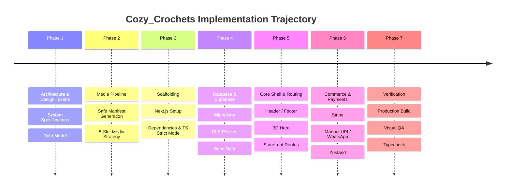

# IMPLEMENTATION_PLAN.md — Cozy_Crochets Development Roadmap

## Executive Summary

Cozy_Crochets ("The Living Yarn Store") is a premium e-commerce storefront delivering handmade crochet artistry with high-performance Next.js App Router architecture, an accessible 3D WebGL hero experience, and robust Supabase/Stripe/UPI commerce foundations.

---

## Phase Roadmap

---

## Detailed Phases

### Phase 1: Architecture, Documentation & Tokens (Completed)
- `docs/ARCHITECTURE.md`: High-level system architecture and module boundaries.
- `docs/DESIGN_SYSTEM.md`: Semantic tokens, typography scale, palette, and radii.
- `docs/DATA_MODEL.md`: Supabase SQL schema with integer paise currency.
- `docs/MOTION_SYSTEM.md`: Motion rules, Lenis smooth scroll, and 3D budgets.
- `docs/SECURITY.md`: RLS policies, payment verification, and secrets management.

### Phase 2: Product Media Pipeline
- Create `scripts/generate-product-manifest.ts`.
- Inventory folders: `Bag`, `Boque`, `HeadBands`, `Key_Ring`, `Kid_Shoe`, `Rose`, `Sunflower`.
- Enforce the 5-slot gallery hierarchy (`main` → `video` → `single` → `bundle` → natural sort extras).
- Expose media safely to `public/products/<folder>` using symlinks.

### Phase 3: Project Scaffolding
- Initialize `package.json`, `tsconfig.json`, `next.config.ts`, `tailwind.config.ts`, `postcss.config.mjs`.
- Install dependencies: Next.js, React 19, Tailwind CSS, Three.js, R3F, Drei, GSAP, Lenis, Motion (`motion/react`), Supabase, Stripe, MapLibre GL JS, Zod, React Hook Form, Zustand, Lucide.
- Configure `.env.example` with variable names only.

### Phase 4: Supabase Migrations & Catalog Seed
- Generate `supabase/migrations/20260919000001_initial_schema.sql` with all 13 core tables and RLS.
- Generate `supabase/seed.sql` populating the 7 initial product categories with placeholder descriptions, prices in paise, and sample ratings.

### Phase 5: Core UI Shell, 3D Hero & Routing Tree
- Configure root layout (`layout.tsx`) with Google fonts (`Fraunces` and `Plus Jakarta Sans`) and Lenis smooth scroll provider.
- Implement responsive `Header` with logo, navigation, search, location indicator, cart drawer badge, and account menu.
- Implement `Footer` with brand story, customer care links, and social channels.
- Implement optimized `Hero3DScene` with procedural yarn ball, petals, looping threads, offscreen pause, and reduced-motion fallback.
- Scaffold all customer storefront and administrative routes.

### Phase 6: Commerce, Cart & Payment Abstractions
- Create Zustand `cart-store.ts` with local storage persistence.
- Implement dual payment providers: Stripe API + Manual UPI QR / WhatsApp flow with 6-digit confirmation code.
- Implement Supabase server and client factories.

### Phase 7: Verification & Build
- Verify media indexing (`npm run generate-manifest`).
- Run strict TypeScript check (`npm run typecheck`).
- Run production build (`npm run build`).
- Verify responsive layout, WebGL fallback, and accessibility compliance.
