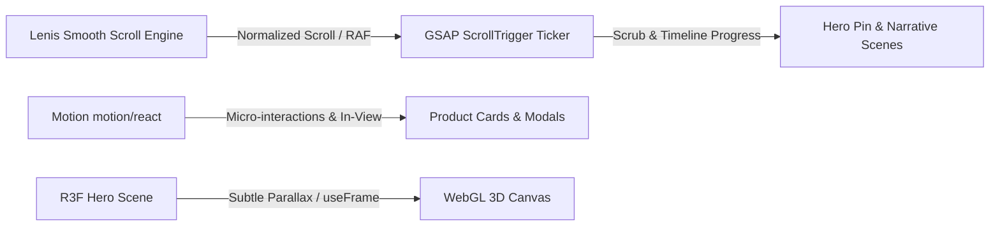

# MOTION_SYSTEM.md — Cozy_Crochets Motion Architecture

## 1. Motion Philosophy

Motion at Cozy_Crochets is purposeful, tactile, and restrained. It exists to communicate hierarchy, highlight artisanal texture, and evoke the gentle pacing of handcraft.

**The Golden Rule**: *Do NOT make the entire commerce interface a WebGL application.*

- Ordinary product cards and UI elements rely on GPU-accelerated CSS and Motion (`motion/react`).
- Smooth scrolling is managed at the root by Lenis.
- GSAP and ScrollTrigger are reserved strictly for narrative sections (hero reveal, the "How a Crochet Flower is Born" craft timeline).
- Three.js / React Three Fiber is isolated to **one heroic 3D canvas** in the hero section.

---

## 2. Orchestration Stack



---

## 3. Motion Timing Tokens

All motion across GSAP, Motion, and CSS adheres to standardized tokens:

| Token Name | Duration | Easing Function | Application |
|---|---|---|---|
| `duration-fast` | `150ms` | `cubic-bezier(0.2, 0, 0, 1)` | Button press, chip toggles, active states |
| `duration-base` | `250ms–350ms` | `cubic-bezier(0.16, 1, 0.3, 1)` | Dropdown open, dialog scale, hover lift |
| `duration-reveal` | `600ms–800ms` | `cubic-bezier(0.22, 1, 0.36, 1)` | Section scroll entrances, image reveals |
| `duration-hero` | `800ms–1000ms`| `cubic-bezier(0.16, 1, 0.3, 1)` | Hero headline resolve & yarn float |

---

## 4. 3D WebGL Hero Architecture

### 4.1 Concept & Mesh Topology
"The Living Yarn Store" hero features an interactive, tactile composition:
- **Procedural Yarn Core**: A warm textured sphere wrapped with looping parametric Bézier curves representing continuous yarn threads.
- **Crochet Petal Formations**: Sculpted geometric petal arrangements mimicking handcrafted flower stitches.
- **Floating Fiber Ornaments**: Gentle, low-poly yarn motes drifting in the periphery with organic perlin noise drift.

### 4.2 Performance Budgets & Device Safeguards
- **DPR Capping**: Capped at `[1, 1.75]` on desktop; `[1, 1.25]` on mobile devices.
- **Draw Call Budget**: `< 150` on desktop, `< 50` on mobile.
- **Offscreen Suspension**: An `IntersectionObserver` detects when the hero canvas scrolls out of viewport, immediately pausing `useFrame` animation and halting render passes.
- **Document Visibility**: Listens to `visibilitychange`. If the user switches tabs, rendering freezes to conserve battery and CPU.
- **Dynamic Import**: The WebGL canvas component is loaded dynamically (`next/dynamic` with `ssr: false`), preventing SSR hydration bottlenecks and ensuring critical HTML/CSS paints first.

---

## 5. Lenis Smooth Scroll Integration

Smooth scrolling is attached once at the root level via a dedicated client provider:

```typescript
const lenis = new Lenis({
  duration: 1.1,
  easing: (t) => Math.min(1, 1.001 - Math.pow(2, -10 * t)),
  orientation: 'vertical',
  gestureOrientation: 'vertical',
  smoothWheel: true,
  touchMultiplier: 1.5,
});

// Synchronize Lenis with GSAP ScrollTrigger
lenis.on('scroll', ScrollTrigger.update);
gsap.ticker.add((time) => {
  lenis.raf(time * 1000);
});
gsap.ticker.lagSmoothing(0);
```

When modal dialogs, drawers, or the product lightbox open, `lenis.stop()` is invoked to prevent background scroll fighting. On dismiss, `lenis.start()` resumes normal glide.

---

## 6. Accessibility & Reduced Motion Support

Any user with `prefers-reduced-motion: reduce` must experience a complete, elegant, and non-animated storefront:
- 3D WebGL scene replaces the animated canvas with a pre-rendered high-definition studio photograph of the yarn and rose arrangement.
- Lenis smooth scrolling is completely bypassed, allowing native OS scrolling.
- GSAP and Motion entrance animations instantly jump to completed state (`opacity: 1`, `transform: none`).
- Media galleries remain navigable via discrete clicks and swipes without automatic transitions.
